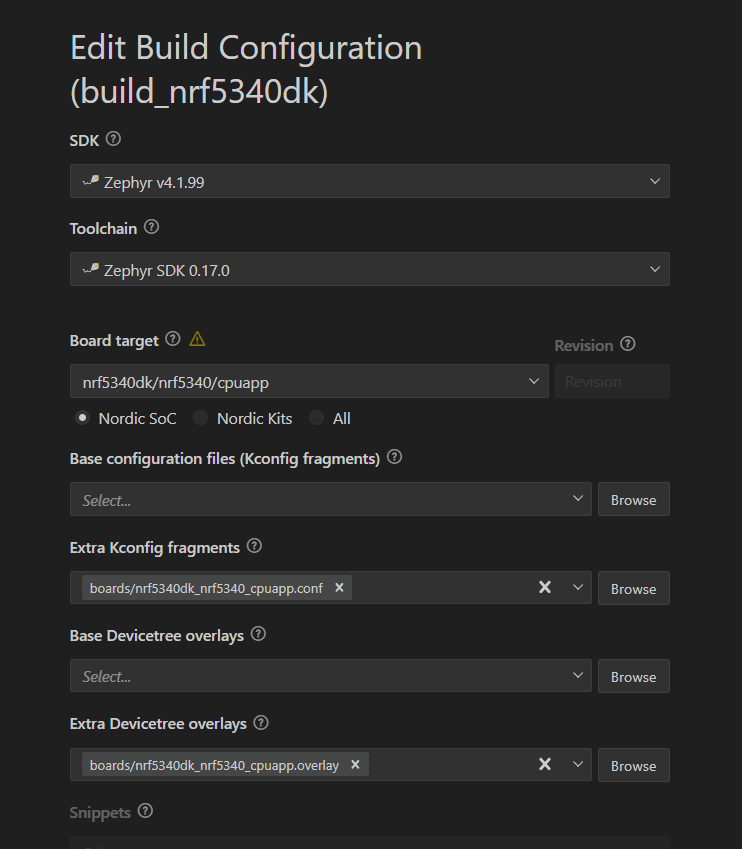
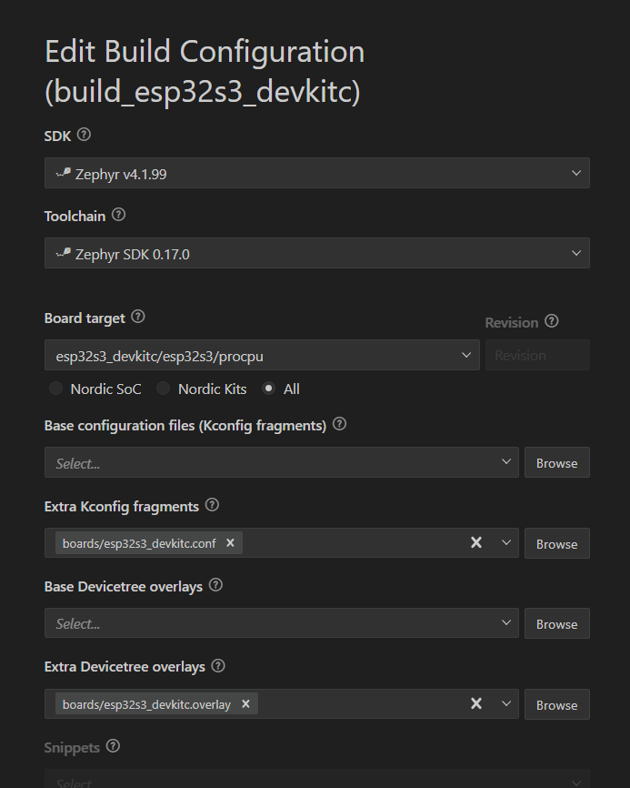

# Zephyr Display IMU

Reads the IMU and shows in Display

## Prerequisite
- Install VSCode, nRF Connect Extension
- Manage toolchains (Zephyr v4.1.99), Manage SDKs (Zephyr SDK 0.17.0)

## Configure
- nRF Connect Extension > Add build configuration > Generate and Build
- nrf5340dk
    
- esp32s3
    

## Build
- nRF Connect Extension > Activate `build_{board}`
- Build > Connect to Serial Port

## Flashing ESP32S3
- nRF Connect Extension > Activate `build_esp32s3_devkitc`
- Start new Zephyr Terminal from `{Root}/build_esp32s3_devkitc/` folder
- Flash & Monitor

    ```shell
    west flash --build-dir . --esp-device COM6 && python -m serial.tools.miniterm COM6 115200
    ```